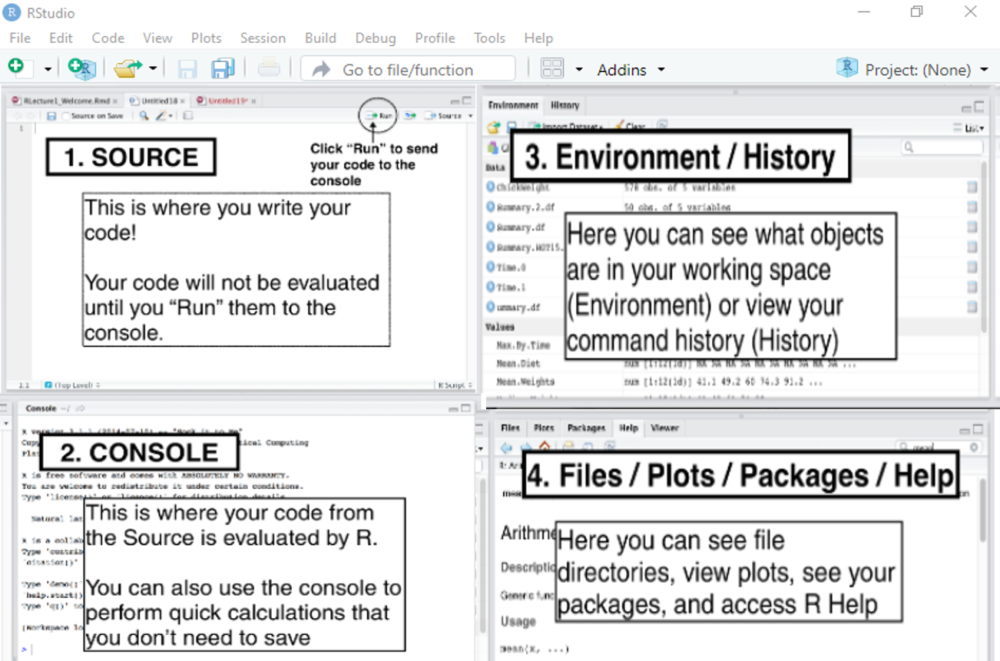

---
output:
  xaringan::moon_reader:
    yolo: false
    lib_dir: libs
    css: xaringan-themer.css
    seal: false
    nature:
      #autoplay: 30000
      #countdown: 60000
      highlightStyle: github
      highlightLines: true
      highlightSpans: true
      countIncrementalSlides: false
      #ratio: 16:9
      slideNumberFormat: "%current%"
editor_options: 
  chunk_output_type: console
---

```{r setup, include=FALSE}
options(htmltools.dir.version = FALSE)

knitr::opts_chunk$set(echo = TRUE, 
                      tidy = 'styler', 
                      comment = NA,
                      message = FALSE,
                      warning = FALSE)
```


```{r xaringan-themer, include=FALSE, warning=FALSE}
library(xaringanthemer)
style_duo_accent(
  primary_color = "#1381B0",
  secondary_color = "#FF961C",
  inverse_header_color = "#FFFFFF"
)

# Loaded packages

install.load::install_load(c("knitr", "xaringanExtra", "xaringan", "tidyverse", "kableExtra", "countdown"))

xaringanExtra::use_xaringan_extra(include = c("tile_view", "editable", "share_again", "broadcast", "animate_css", "panelset", "tachyons", "fit_screen", "clipboard", "search", "scribble", "freezeframe"))

use_webcam(width = 150, height = 150)

use_extra_styles()
```

background-image: url(images/gbg.png), url(images/R_logo.png)
background-position: 0% 100%, 100% 0%
background-size: 40%, 10%

class: title-page, center, middle

## R Programming Fundamentals

```{r, echo=FALSE}
use_logo(
  image_url = "images/gbg.png",
  link_url = "https://bit.ly/gbganalyst",
  position = xaringanExtra::css_position(top = "1em", right = "1em"),
  exclude_class = c("title-page", "inverse", "hide_logo")
)
```

---
class: about-me-slide, inverse, middle, center

## About the trainer


### Ezekiel Adebayo Ogundepo

#### Data Scientist, Statistician

.fade[Virus Outbreak Data Network (VODAN Africa & Asia)<br> Nigeria Chapter]


[`r icons::fontawesome("link")` https://bit.ly/gbganalyst](https://bit.ly/gbganalyst)
[`r icons::fontawesome("twitter")` @gbganalyst](https://twitter.com/gbganalyst)
[`r icons::icon_style(icons::fontawesome("github"), scale = 1)` @gbganalyst](https://github.com/gbganalyst)

---
class: middle

.w-100.lh-copy[

Goal:

> The goal of this R session is to help you learn the most important skills in R for data science.


]


---
background-image: url(images/relax.jpg)
background-size: cover
background-position: 50% 50%
class: center, top, hide_logo

## Relax, programming in R is cool!


---
class: inverse, middle
name: toc

# Table of content

.pull-left[
.w-100.lh-copy[

- [History and Overview of R](#hist)

- [R for Data Science](#r4ds)

- [R as a Calculator](#cal)
]
]

--

.pull-right[
.w-100.lh-copy[

- [Atomic Data Type and Variable Assignment in R](#var)

- [Basic Data Structure in R](#basic)

- [Write your own function in R](#function)
]
]

---

background-image: url(images/lekan.jpeg)
background-size: cover
background-position: 50% 50%
class: bottom, center, inverse

## Let's get started!


---
class: middle, center, inverse
name: hist

# History and Overview of R

---
class: middle

# History of R

.w-100.lh-copy[
R is a programming language and free software environment for statistical
computations, data cleaning, data analysis, and graphical representation of data. The R language is widely used among statisticians and data miners
for developing statistical software and data analysis.
]

--

.w-100.lh-copy[
In the year `2020`, the R community celebrated the 20th year of R version `1.0.0`. The current version of R programming is `4.1.0` with the nickname *Camp Pontanezen*. 
]

--

.w-100.lh-copy[

R has released so many versions and you can see their list by using:

```{r, eval=FALSE}
rversions::r_versions()
```
]

--
Please note that you will need to install `rversions` package before `rversions::r_versions()` can work.

---
## Why R programming?

```{r, echo=FALSE, out.height= "100%"}

```

---

# LearnR, UseR, and ThinkR

```{r, echo= FALSE, out.width= "100%", out.height= "100%"}

```

[Companies](https://www.quora.com/Which-companies-use-R) that use R for Analytics

---
# R Learning Curve

.w-100.lh-copy[
As many have said, R makes hard things easy. The learning curve for R is pretty steep for a beginner. Though R is a bit difficult in the beginning, data science enthusiasts still prefer to learn it due to the amazing features of R.
]

```{r, echo= FALSE, out.width= "85%", out.height= "85%"}

```

---
background-image:url(images/R.PNG)
background-size: contain
class: center, bottom

### R programming interface


---
class: middle

# RStudio

.w-100.lh-copy[
RStudio is an integrated development environment (IDE) for R programming. RStudio makes programming easier and friendly in R.
]

---

# RStudio

The current version of RStudio is `1.4.1717`

```{r, echo=FALSE, out.height= "100%"}
include_graphics("images/R_studio.PNG")
```


---

### Installing R and RStudio


.panelset[

.panel[.panel-name[Install R]


You can install R on any operating system (OS).

**For Windows** :

- Download R for Windows OS from this [link](https://cran.r-project.org/bin/windows/base/)

- Open the `.exe` file and install it.

**For Mac** :

Download R for Mac via this [link](https://cran.r-project.org/bin/macosx/). Please make sure you click on the first `.pkg` link,

- Open the `.pkg` file and install it.

**For Linux**:

For complete R System installation in Linux, follow the instructions on this
[link](https://cran.r-project.org/).

For Ubuntu with Apt-get installed, execute `sudo apt-get install r-base` in the terminal.

]

.panel[.panel-name[Install RStudio]

.w-100.lh-copy[
You can install RStudio via this [link](https://www.rstudio.com/products/rstudio/download/#download), choose the appropriate installer file for your operating system, download it, and then run it to install RStudio.
]
]
]

---

class: center, middle, inverse
name: r4ds

# R for Data Science


---
# What is data science?

.w-100.lh-copy[
Data science is an exciting discipline that allows you to turn raw data into understanding, insight, and knowledge <sup>1</sup>. ]

--

```{r, echo=FALSE, out.width = "100%",fig.cap= "Data Science Phases~Inspired by Hadley"}
include_graphics("images/r4ds.JPG")
```


--

.footnote[
[1] R for data science, https://r4ds.had.co.nz
]

---
class: middle

# R learning R Materials
	
You can learn R through the following useful selected materials:

--

- [YaRrr! The Pirate’s Guide to R](https://bookdown.org/ndphillips/YaRrr/)

--

- [R for Data Science](https://r4ds.had.co.nz)

--

- [R for Data Science: Exercise Solutions](https://jrnold.github.io/r4ds-exercise-solutions/)

--

- [Big Book of R](https://www.bigbookofr.com/)

--

- [Posts you might have missed!](https://postsyoumighthavemissed.com/search/)

---
class: middle

# Introduction to R
.w-100.lh-copy[
In this section, you will take your first steps with R. You will learn how 
to navigate through the four windows in Rstudio, use R as a calculator and  assign values to variables. You will also get to know the basic data types in R. 
]

--

  

---

## The four panes of RStudio

```{r, echo=FALSE, out.height= "85%", out.width= "90%"}

```

--

**Let's open our RStudio!**

---

class: center, middle, inverse
name: cal

# R as a calculator

```{r, echo=FALSE, out.height= "55%", out.width= "60%"}

```

---

# R as a calculator

.w-100.lh-copy[
In its most basic form, R can be used as a simple calculator. Consider the
following arithmetic operations:
]

--

.pull-left[
- Addition (`+`)

- Subtraction (`-`)

- Multiplication (`*`)

- Division (`/`)
]

--

.pull-right[

- Exponentiation (`^`)

- Modulo (`%%`)

- Parenthesis `()`
]

---

.pull-left[

### Addition and Subtraction

```{r}
6 + 12 -8
```

```{r}
56 - 14 + 100
```

```{r}
1 + 3 + 2
```

```{r}
7 + 15 - 10 + 18 - 6 + 11 - 14 
```

```{r}
2 + 3 + 6
```


]

--
.pull-right[

### Multiplication and Division

```{r}
2 * 3
```

```{r}
100 / 50
```

```{r}
3*5/3
```

```{r}
-2*4 
```

```{r}
8 * -5
```

]


---

## Exponentiation

```{r}
3^2

2 * 2^3


2 ^ 3 - 9

2 - 2 ^ 3

3^2 - 1 * 4 + 2
```


---

## Modulus

.w-100.lh-copy[
The modulo (or “modulus” or “mod”) is the remainder after dividing one number by another. For example, `9 mod 2 = 1`. Because `9/2 = 4` with a remainder of 1. In mathematics, we write that as `9 mod 2 = 1` and in R we write it as `9 %% 2 = 1`
]

```{r}
9 %% 2
```

```{r}
11 %% 3 
```

```{r}
11 %% 3 - 4
```

```{r}
16 %% 3
```

---

# Parenthesis or brackets

.w-100.lh-copy[
Parentheses are used to denote grouping of operation in mathematics. It denotes modifications to normal order of operations. Remember **BODMAS** in mathematics? We shall use BEDMAS in programming:
]

--

- B - Bracket

- E - Exponentiation

- D - Division

- M - Multiplication

- A - Addition

- S - Subtraction

--

.w-100.lh-copy[
In an expression like $3 \times (2+3)$, the part of the expression within the parentheses, $(2 + 3) = 5$, is evaluated first, and then this result is used in the rest of the expression i.e. $3 \times 5 = 15$.
]

---

## Examples 


$3 \times (2 + 3)$
```{r}
3 * (2 + 3)
```

$(3+2) \times (6-4)$

```{r}
(3 + 2) * (6 - 4)
```

$6-(5\times1)+2^3$

```{r}
6-(5*1) + 2^3 
```
---

# Operations involving square root

Use R to evaluate $\sqrt{125}$ 

```{r}
sqrt(125)
```

Use R to evaluate $\dfrac{19}{\sqrt{19}}$

```{r}
19/sqrt(19)
```

Evaluate $\dfrac{2\sqrt{3}}{3\sqrt{10}}$

```{r}
(2 * sqrt(3)) / (3 * sqrt(10))
```

---

### Comment in R

R makes use of the **#** sign to add comments. Adding comment to your code is a common practice in all programming languages. This is important because:

1.	It makes you remember a line of code you have written after leaving it for a while.

2.	It makes others who want to check your code to understand it line by line.

3.	It is good for documentation purpose.

--

Comments are not run as R code, so they will not influence your result and R ignores any anything that has **#** sign.

--

**Examples**

```{r}
# We use * for multiplication in R

2 * 8
```

--

It is important to put a space after the **#** for easy readability.

```{r}
3 + 6 # a space after #<<
```


---

# Comparison Operators

.w-100.lh-copy[
We can compare two or more values by using comparison operators. These types of operators compare one value to another based on a condition. The result can either be `TRUE` or `FALSE`, known as logical. The following are the most common comparison operators in R:
]

--

-	double equal to (`==`)

- not equal to (`!=`)

- greater than (`>`)

- less than (`<`)

- greater than or equal to (`>=`)

- less than or equal to (`<=`)

---

### Examples

.pull-left[
```{r}
5 == 3
```

```{r}
25 != 10
```

```{r}
100 > 30
```

```{r}
-6 < -5
```
]

--

.pull-right[
```{r}
60 >= 45
```

```{r}
100 <= 1000
```

```{r}
0 < -1
```

```{r}
-1 > 1
```

]

---
class: middle, center, inverse
name: var

## Atomic Data Type in R


```{r, echo=FALSE, out.height= "100%", out.width = "100%"}

```


---
# Classes of objects in R

.w-100.lh-copy[
R works with numerous atomic classes of objects. The most basic
atomic data types are:

- `Numeric` such as integer (4, -2) or float (4.7, -0.26)

- `Character` such as texts (or strings) and must be enclosed within either single or double quotes. e.g. "Nigeria", "COVID-19", "baby", "Hello world".

- `Logical` such as `TRUE` or `FALSE`

- `Complex` - A complex number in mathematics. It is written as `a + bi` where `a` is the real part and `b` is the imaginary part. e.g. `2 + 2i`, `3 - 3i`.
]

--

.w-100.lh-copy[
We use `class()` function to check or determine the type of any object in `R`.
]

---

### Examples

.pull-left[

```{r}
class(2)
```


```{r}
class(3.145)

class("female")

class("I am from Abuja")
```
]

.pull-right[

```{r}
class(TRUE)

class(FALSE)

class(2+2i)

class(3-6i)
```

]

---

### Variable assignment

.w-100.lh-copy[
A variable allows you to store a value (e.g. 5) or an object (e.g. a function
description) in `R`. You can then later use this variable’s name to easily access the value or the object that is stored with it. 
]

--

.w-100.lh-copy[
You can create a variable with the help of an **assignment operator** `<-` or `=`. 
]

--


### Examples


.pull-left[

```{r}
ezekiel <- 4
```

```{r}
ezekiel
```

You can access the type of object in `ezekiel`:

```{r}
class(ezekiel)
```
]

--
.pull-right[

```{r}
state <-  "Lagos"
```
```{r}
state
```

```{r}
class(state)
```
]
---

## Variable assignment

.pull-left[
```{r}
# Age now

age = 15

age
```

```{r}
class(age)
```

```{r}
# Next year age

age + 1
```

```{r}
# Age two years ago

age - 2
```
]

--

.pull-right[

### Other examples

```{r}
name = "Gift"

age = 30

gender = "Female"

country = "Nigeria"

smile_face = TRUE

```

]

---

## Rules for naming variables

.w-100.lh-copy[

* All variables must begin with a letter of the alphabet.

* After the initial letter, variable names can also contain (_ or .) and numbers. No spaces or special characters, however are allowed.

* R is case sensitive. Uppercase characters are different from lowercase characters.
]

--

```{r, echo=FALSE}

sample <- tibble::tribble(
  ~`Samples of acceptable variable names`, ~`Samples of unacceptable variable names`,
  "health.status", "health(status)",
  "covid_19_cases", "covid-19-cases",
  "budget2021", "2021budget", "sales_price_2021", "sales price 2021"
)

sample %>% kable(format = "html")
```
<br>

--

.w-100.lh-copy[
The best naming convention is to choose a variable name that will tell the reader of the program what the variable represents.
]

---

### Exercise

What is the class of the following data types?


```{r}
age <- 15
```
.can-edit[
 
]

```{r}
diabetic_status <- "No"
```

.can-edit[

]

```{r}
five_less_than_2 <- FALSE
```

.can-edit[

]


```{r}
weight <- "60.4 kg"
```

.can-edit[

]

```{r}
smile_face <- "FALSE"
```

.can-edit[

]


`r countdown(minutes = 0, seconds = 42)`

---

## Data type conversions

.w-100.lh-copy[
`R` allows us to convert objects from one data type to another. For example you may need to convert your `character` variable to a `numeric`. In programming this is called `typecasting` and has a lot of very many useful applications as will be shown later.
]

--

.w-100.lh-copy[
Consider the following scenario: You have a variable called `weight` that you assign `"64.45"` to instead of `64.45`. You may need to convert this to numeric/double so that you can use it appropriately in your code.
]

--

.w-100.lh-copy[
In order to convert the data, you need to use the `as.datatype_name` function. As part of this function, you specify the data type you are converting to. The following table shows examples of those functions:
]

--

```{r, echo=FALSE, fig.align='left'}
tibble::tribble(
  ~ `Data type converting to`,                     ~`How to do it`,
       "numeric",   "as.numeric(variable_name)",
     "character", "as.character(variable_name)",
       "logical",   "as.logical(variable_name)",
        "complex",    "as.complex(variable_name)"
  ) %>% kable()

```

---
### Examples

```{r}
weight <- "64.45"

smiling_face <- "FALSE"

height <- "161.5 cm"

```
--

As you can see, some of the variables are not in the right data type.

--

```{r, tidy=FALSE}
weight_before <- "64.45"

class(weight_before)

weight_now = as.numeric(`weight_before`)

weight_now

class(weight_now)
```

---
### Examples

```{r, tidy=FALSE}
smiling_face_old <- "FALSE"

smiling_face_old

class(smiling_face_old)

smiling_face_new <- as.logical(`smiling_face_old`)

smiling_face_new

class(smiling_face_new)

```

---

### The `NA` Result

.w-100.lh-copy[
If R cannot convert an object, then it will return an `NA` (Not Available). This is its way of saying that it tried to convert the value, but it couldn't find anything that would logically match with the conversion. The following scenarios will return `NA` values:
]

--

- Converting mixed-characters to numeric, e.g. `"334cm"`

--

- Converting any character to logical, except `TRUE(T)` or `FALSE(F)`.

--

```{r, warning=FALSE, error=TRUE}
height <- "161.5 cm"

as.numeric(`height`)
```

--

.pull-left[
```{r}
smiling_face <- "No"

as.logical(`smiling_face`)
```
]

--

.pull-right[
```{r}
smiling_face <- "Yes"

as.logical(`smiling_face`)
```
]
---

class: center, middle, inverse
name: basic

# Basic data structure in R

```{r, echo=FALSE, out.height= "95%", out.width = "60%"}

```

---
class: middle 

# Basic data structure 

--

1. [Vector :  A collection of elements of the same class](#vector)

--

1. [Matrix : All columns must uniformly contain only one data type](#matrix)

--

1. [Data frame : The columns can contain different classes](#df)

--

1. [List : Can hold object of different classes and length](#list)

---

class: middle, center, inverse
name: vector

# Vector

```{r, echo=FALSE, out.height= "95%", out.width = "65%"}

```

---
## A vector

.w-100.lh-copy[
A vector is a one-dimensional array that can hold data type. In `R`, you can create a vector by using combine or concatenate function, `c()`. When using `c()`, you will place a comma in between the objects (vector elements) you want to combine.
]

--

### Examples

```{r}
covid_confirmed <- c(31, 30, 37, 25, 33, 34, 26, 32, 23, 45) 
```
--

```{r}
month <- c("January", "February",  "March", "April",  "May", "June", "July", "August", "September", "October")
```
--

```{r}
gender <- c("Male", "Female", "Female", "Male", "Female", "Male")
```

--
#### Note

.w-100.lh-copy[
Adding a space after every comma in the `c()` function improves the readability of your code.
]

---
layout: true
## A vector

---
.w-100.lh-copy[

A vector can be of different data type such as `numeric`, `character`, `logical`, or `factor`.
]

--

### Examples

```{r}
covid_confirmed <- c(31, 30, 37, 25, 33, 34, 26, 32, 23, 45)

class(covid_confirmed)
```
--

```{r}
month <- c("January", "February",  "March", "April",  "May", "June", "July", "August", "September", "October")

class(month)

```
---
layout: false

### A factor vector

.w-100.lh-copy[
A categorical variable where each level is a category will be of type `factor`. For example, gender is a categorical variable that has two levels, "Male" or "Female". We can easily get a factor vector from a character vector by using the function `factor()` or `as.factor()`.
]
--

**Example 1**

You can create a factor vector directly by using the function `factor()`:

--

```{r}
gender_factor <- factor(c("Male", "Female", "Female", "Male", "Female"))

gender_factor
```
--

```{r}
class(gender_factor)
```
--

```{r}
levels(gender_factor)
```
---

**Example 2**

.w-100.lh-copy[
If you already have a `character vector`, then you can use `as.factor()` function to convert it to a `factor  vector`.
]

--

```{r}
gender <- c("Male", "Female", "Female", "Male", "Female")

gender_factor = as.factor(gender)

gender_factor
```
--

```{r}
class(gender_factor)
```
--

```{r}
levels(gender_factor)
```
---

## Length of a vector

You can get the length of a vector by using the function `length()`:

```{r}
covid_confirmed <- c(31, 30, 37, 25, 33, 34, 26, 32, 23, 45) 

length(covid_confirmed)
```

```{r}
month <- c("January", "February",  "March", "April",  "May", "June", "July", "August", "September", "October", "November", "December")

length(month)
```

```{r}
gender <- c("Male", "Female", "Female", "Male", "Female", "Male")

length(gender)
```

---

## Naming a vector
.w-100.lh-copy[
As a data analyst, it is important to have a clear view on the data that you are using. Understanding what each element refers to is essential. You can give  a name to the elements of a vector with the `names()` function
]

### Example

```{r}
sales_amount <- c(140000, 200000, 600000, 180000, 170000)

names(sales_amount) <- c('Monday','Tuesday','Wednessday', 'Thursday','Friday')

sales_amount
```

---

### Arithmetic operations with vectors

If you add two vectors together, R sum it element-wise.

#### Example 

```{r, echo=T}
egg_weight1 = c(59, 56, 61, 68, 52, 53, 69, 54, 57, 51)

egg_weight2 = c(56, 51, 69, 52, 57, 68, 61, 54, 59, 53)
```

```{r}

total_weight = egg_weight1 + egg_weight2

total_weight
```

--

#### Exercise

```{r}
oyo_covid_19 <- c("36","26","30","22","35","34","37","24","32","40")

lagos_covid_19 <- c(49, 33, 36, 67, 65, 32, 63, 48, 57, 30)

```
Why would `oyo_covid_19 + lagos_covid_19` throw an error?  
--
How can you correct it?

.can-edit[

]


---

# Vector selection
.w-100.lh-copy[
To select elements of a vector (and later matrices, data frames), you will use square brackets `[ ]` and between the square brackets, you indicate the index of elements to select.

R index starts at $1$, for example:
]

```{r, echo= F}
dd <-  data.frame(
  stringsAsFactors = FALSE,
          `week_day` = "index",
            Monday = 1,
           Tuesday = 2,
        Wednessday = 3,
          Thursday = 4,
            Friday = 5,
          Saturday = 6,
            Sunday = 7
       )

dd %>% kableExtra::kable(format = "html", align = "c")
```
.w-100.lh-copy[
To access the first element of a vector  `week_day`, you will use: 

```{r, eval=FALSE}
week_day[1]
```
and for second element, use:

```{r, eval=FALSE}
week_day[2]
```
]
---

### Examples

```{r}
week_day <- c("Monday", "Tuesday", "Wednessday", "Thursday", "Friday", "Saturday", "Sunday")
```

```{r}
week_day[1]

week_day[4]
```
--

### Exercise

How can we access both `Monday` and `Thursday` from the vector, `week_day`?

.can-edit[
 
]

```{r, echo=FALSE}
countdown(minute = 2, seconds = 00, bottom = 0)
```

---

### Exercise

.w-100.lh-copy[
Data relating to the marks of 13 students in the Introduction to R quiz are giving below:

`10, 15, 10, 9, 18, 16, 14, 12, 16, 13, 15, 20, 17`.
]

- Create a vector name `score` for the data 

.can-edit[
 
]


- Use R to access the score of the 1st, 5th and 10th student (each individually)

.can-edit[
 
]

- Use R to access them altogether

.can-edit[
 
]

```{r, echo=FALSE}
countdown(minutes = 2, seconds = 00, bottom  = 0)
```

---

## Think about it!

```{r, eval=FALSE}
marks = c(10, 15, 10, 9, 18, 16, 14, 12, 16, 13, 15, 20, 17)

marks[marks > 13]
```

```{r, echo=FALSE}
countdown(minutes = 1, seconds = 00, bottom  = 0)
```

---
layout: true

## How to find the index of elements in a vector

---

.w-100.lh-copy[
Every element in the vector has a particular position or index. It is possible to know the index of any element using built-in functions in R like `which()`, and `match()`.
]

--

.w-100.lh-copy[

**The `which()` function**

The `which()` function returns a vector with the index (or indexes) of the element which matches the logical vector.
]

--

**Example 1**

What is the index of "New Jersey" in the vector `state`?

```{r, tidy=FALSE}
state_name <- c("South Carolina", "Minnesota", "Michigan", "New York",  
"Arizona", "Texas", "New Jersey", "Rhode Island", "Massachusetts", "Delaware", "Arizona")

which(state_name == "New Jersey")
```


---

.w-100.lh-copy[
We can also use the `which()` function to find the indexes of multiple elements using the `%in%` parameter, which returns a vector with a `TRUE` value for every element that matches.
]

--

**Example 2**

What are the indexes of the following elements:

.pull-left[
- South Carolina  
- Texas
]

.pull-right[
- Massachusetts
- Arizona
]

in the vector `state_name`?

--

```{r, tidy=FALSE}
which(state_name %in% c("South Carolina", "Texas", "Massachusetts",
                   "Arizona"))
```


---
.w-100.lh-copy[

**The `match` function**

The `match()` function is very similar to the `which()` function. It returns a vector with the first index (if the element is at more than one position) of the element and is considered faster than the `which()` function.
]

--

**Example 1**

```{r, tidy=FALSE}
state_abbrev <-  c("DE","MA", "AZ", "MI", "MN", "NJ", "AZ", "NY", 
                   "RI",  "SC", "TX")

match("AZ", state_abbrev)
```

---

.w-100.lh-copy[
We can also use it for finding the first index of multiple elements, as shown below:

```{r, tidy=FALSE}
state_abbrev <-  c("DE","MA", "AZ", "MI", "MN", "NJ", "AZ", "NY", 
                   "RI",  "SC", "TX", "DE")

match(c("AZ", "DE"), state_abbrev)
```


Note that only the first positions of both "AZ" and "DE" are returned by the `match()` function. That is why the `match()` is considered to be faster of the two methods for such situations where only the first index is required.
]

---
layout: false

## Special vectors 

--

```{r, echo = T}
a <- 1:10 # Create sequence 1 to 10 

a
```
--

```{r}
b <- 10:1 # Create sequence 10 to 1

b
```
---
layout: true

### Data simulation using `seq()` function

---
The `seq()` function generate  sequence of number.

`seq(from, to, by, length.out)`

--

.pull-left[
`from`: the start of the sequence

`to`: the end of the sequence
]

--
.pull-right[
`by`: increment of the sequence

`length.out`: desired length of the sequence.
]

--

To get help on `seq()` function, use `?seq`

```{r, eval=FALSE}
?seq
```

---

#### Examples

```{r}
seq(from = 1, to = 16, by = 2)
```
--

```{r}
seq(1, 8, 0.1)
```

--

```{r}
seq(7, 1, -0.1)
```
---
.w-100.lh-copy[
If you have a sequence of number and you don't know the last element, say you just know the start of the sequence and the length of the sequence, e.g.
]

--

```{r}
seq(5, by=2, length=50)
```
---
layout: true

### Data simulation using the `rep()` function

---
The `rep()` function repeat elements for a certain number of time

`rep(x, times = 1, length.out = NA, each = 1)`

`x`: object to repeat 

`times`: number of times to repeat each element

`length.out`: The desired length of the output vector.

`each`: Each element of x is repeated each times.

--

#### Example 1

```{r}
rep(5, 10) # Repeat 5 in 10 times
```

---

#### More examples

```{r}
rep("God is good", 5)
```
--

```{r}
rep(1:4, 5) # Repeat 1 to 4 in five times
```
--

```{r}
rep(c("Female", "Male"), 4)
```
--

```{r}
rep(1:4, each = 3) # repeat each element in 3 times
```

---

#### Think about these:

```{r, eval=F}
rep(1:4, each=3, time=2)

rep(1:4, 1:4)

rep(1:4, c(4,1,8,2))
```

```{r, echo=FALSE}
countdown(minutes = 2, seconds = 00, bottom  = 0)
```
---
layout: true

### Data simulation using `sample()` function 

---
.w-100.lh-copy[
The `sample()` function allows you to draw random samples of elements from a vector.

`sample(x, size, replace = FALSE, prob = NULL)`

`x`: A vector of outcomes you want to sample from.

`size`: The number of samples you want to draw

`replace`: Should sampling be done with replacement (`TRUE`/`FALSE`)

`prob`: A vector of probabilities of the same length as `x` indicating how likely each outcome in `x` is. If you don’t specify the prob argument, all outcomes will be equally likely.
]

---

### Example 

.w-100.lh-copy[
Randomly pick four fruits from the list of fruits in Apple, Banana, Cherry, Orange, Pineapples, Grape, and Pawpaw.
]

--

```{r}
fruit <- c("Apple","Banana","Cherry","Orange","Pineapples","Grape","Pawpaw")

sample(x = fruit, size= 4)
```
--

Since data generated by using `sample()` function is purely randomized, 
--
if you run the same `sample(x = fruit, size= 4)` again, a different data would be generated.

```{r}
sample(x = fruit, size= 4)
```
---

.w-100.lh-copy[
The `set.seed()` function helps us to generate the same data when you specify any integer in it.
]

--

#### Example 1

```{r}
set.seed(121)

fruit <- c("Apple","Banana","Cherry","Orange","Pineapple","Grape","Pawpaw", "Mango", "Carrot")

sample(fruit, size=  5)
```
--

#### Example 2

```{r}
set.seed(121)

fruit <- c("Apple","Banana","Cherry","Orange","Pineapple","Grape","Pawpaw", "Mango", "Carrot")

sample(fruit, size=  5)
```

### Example 4

Draw 20 samples from the integers 1 to 10 with replacement.

--

```{r}
sample(x = 1:10, size = 20, replace = TRUE)
```

---

.w-100.lh-copy[
Let’s simulate `10` flips of a biased coin, where the probability of getting a Head (`H`) is `0.7` and the probability of a Tail(`T`) is `0.3`.
]

--

```{r}
sample(x = c("H", "T"),
       prob = c(0.7, 0.3), # Make the coin biased for Heads
       size = 10,
       replace = TRUE)
```

--

### Exercise

.w-100.lh-copy[
Suppose you are drawing coins from a treasure chest. There are 100 coins in this chest: 20 gold, 30 silver, and 50 bronze.
]

Use R to draw 10 random coins from the chest.

.can-edit[

]

```{r, echo=FALSE}
countdown(minutes = 2, seconds = 00, bottom  = 0)
```
---
layout: true

## Statistical distribution- Data simulation

---

Statistics has so many distributions. Some are discrete while some are continuous. 

--

### Discrete distribution

- Binomial
- Poisson
- Geometric
and many more

--

### Continuous distribution

- Normal 
- Uniform
- Exponential
- Beta
and many more.

--

You can use `?Distributions` to get the list and references to each of the distributions.

```{r, eval=FALSE}
?Distributions
```

---

### The Poisson distribution

--
.w-100.lh-copy[
Poisson distribution is a probability distribution that can be used to show how many times an event is likely to occur within a specified period of time. Poisson distribution has only one parameter, lambda, $\lambda$,  and to generate samples from it in R, we use the function `rpois()`.
]

--

`rpois(n, lambda)`

`n`: number of random values to return.

`lambda`: the mean of the distribution

---

### Example

Draw 40 samples from a Poisson distribution with `lambda = 45`.

--

```{r}
poisson_data <- rpois(n = 40, lambda = 45)

poisson_data
```
---

```{r}
hist(poisson_data)
```

---

### Normal distribution

--

.w-100.lh-copy[
The Normal also known as Gaussian distribution is one of the most important distribution in statistics. The Normal distribution is bell-shaped, and has only two parameters: the mean and the standard deviation. To generate samples from a normal distribution in R, we use the function `rnorm()`.
]
--

`rnorm(n, mean = 0, sd = 1)`

`n`:	The number of observations to draw from the distribution

`mean`	The mean of the distribution

`sd`:	The standard deviation of the distribution

---

### Example

Draw 100 samples from a Normal distribution with `mean = 30`, `sd = 5`

--

```{r}
normal_data <- rnorm(n = 100, mean = 30, sd = 5)

normal_data
```

---

```{r}
hist(normal_data)
```

---
layout: false
## Examination on vector

.panelset[

.panel[.panel-name[Exercise]

1. Create a vector of numbers from `1` to `50`.

2. if x is a vector with elements `2, 3, 4, 2, 4, 5, 3, 5, 3, and 5`. Use R to get its length.

  - Find the sum, mean, and variance of vector `x`. 
  
  - Plot a beautiful bar chart for the vector `x`

3.  `x = 2`, `y = 3`, and `z = 6`

  - what is $(x+y)^3$?

  - what is $\frac{z}{y}$?

4. Height and weight are known to follow a normal distribution. 

   `height ~ N(60, 12)` and `weight ~ N(90, 14)`
   
   Generate 50 observations for both `height` and `weight`.
  
  `r countdown(minutes = 5, seconds = 00, warn_when = 60)`

  ]

.panel[.panel-name[Solution 1-2]

#### Solution 1

```{r}
number <- 1: 50
```
#### Solution 2

```{r, eval=FALSE}
x <-  c(2, 3, 4, 2, 4, 5, 3, 5, 3, 5)

sum(x)
mean(x)
var(x)
barplot(table(x), col = "purple") 
```

--

#### Important note

The `table()` function helps us to create a frequency table while `barplot()` plots the bar chart of the result.
]
.panel[.panel-name[Solution 3-4]

#### Solution 3

```{r, eval=FALSE}
x <-  2; y <-  3; z <-  6

(x+y)^3

x/y
```
#### Solution 4

```{r}
height <- rnorm(50, 60, 12)

weight <-  rnorm(50, 90, 14)
```
]

]

---
class: center, middle, inverse
name: matrix

# Matrices


---
# Matrices

.w-100.lh-copy[
In R, a matrix is a collection of elements of the same data type (numeric, character, or logical) arranged into a fixed number of rows and columns.

Since we are only working with rows and columns, a matrix is called a two dimensional array.

You can construct a matrix in R by using `matrix()` function.
]

--

`matrix(data = NA, nrow = 1, ncol = 1, byrow = FALSE)`

--
.w-100.lh-copy[
* The first argument is the collection of elements that `#rstats` will arrange into the rows and columns of the matrix. For example, `c(1, 2, 3, 4, 5, 6, 7, 8, 9)` or its shortcut, `1:9`. 

* The argument `nrow` indicates the number of rows while `ncol` is the number of columns in the matrix

* The argument `byrow` indicates that the matrix is filled row-wise. If we want the matrix to be filled column-wise, we just set `byrow = FALSE`.
]
---

### Example

```{r}
A <- matrix(1:9, nrow = 3, byrow = TRUE)

A
```
--

### Short group work

Create the matrix `A` with R:


$$A = \begin{pmatrix}
1&7&13\\
3&9&15\\
5&11&17
\end{pmatrix}$$


.can-edit[

]


```{r, echo=FALSE}
countdown(minutes = 1, seconds = 00)
```

---

### Other examples

$$A = \begin{pmatrix}
1&-2& 5\\
-3&9&4\\
5&0&6
\end{pmatrix}$$

```{r}
A <- matrix(c(1, -3, 5, -2, 9, 0, 5, 4, 6), nrow = 3, ncol = 3, byrow = FALSE)
```
--

$$B = \begin{pmatrix}
2&-8& 14\\
4&10&16\\
6&12&18
\end{pmatrix}$$

```{r}
B <- matrix(c(2,4,6,8,10,12,14,16,18), nrow = 3, ncol = 3, byrow = FALSE)

B
```

---
layout: true

## Matrices slicing

---

To select elements in a matrix we use square brackets `[ , ]`, between the square brackets, you indicate the position of the row and column in which the elements to select are.

$$A = \begin{pmatrix}
1&-2& 5\\
-3&9&4\\
5&0&6
\end{pmatrix}$$


To select the element in the first row and second column of matrix **A**, you type `A[1, 2]`.  To select the element in the third row and second column of matrix **A**, you type `A[3, 2]`. 

.can-edit[

]

### Examples

--

.pull-left[
```{r}
A[1, 2]
```
]

--

.pull-right[

```{r}
A[3, 2]
```

]

---

Consider the following matrix:

$$A = \begin{pmatrix}
1&-2& 5\\
-3&9&4\\
5&0&6
\end{pmatrix}$$

--

How would you select the following matrices from A?

--

.pull-left[
$$B = \begin{pmatrix}
1&-2\\
-3&9
\end{pmatrix}$$
]


.pull-right[
$$C = \begin{pmatrix}
1& 5\\
5&6
\end{pmatrix}$$

]

.can-edit[

]


```{r, echo=FALSE}
countdown::countdown(minutes = 3, seconds = 00)
```


---
layout: false

## Arithmetic Operation in Matrices

.w-100.lh-copy[
We can perform all the arithmetic operations on matrices. Consider the following matrices
]

.pull-left[
$$A = \begin{pmatrix}
1&-2& 5\\
-3&9&4\\
5&0&6
\end{pmatrix}$$
]

--

.pull-right[

$$B = \begin{pmatrix}
2&-8& 14\\
4&10&16\\
6&12&18
\end{pmatrix}$$

]

--

```{r}
A <- matrix(c(1, -3, 5, -2, 9, 0, 5, 4, 6), nrow = 3, ncol = 3, byrow = FALSE)
```

--

```{r}
B <- matrix(c(2,4,6,8,10,12,14,16,18), nrow = 3, ncol = 3, byrow = FALSE)
```

---
layout: true 

.pull-left[
$$A = \begin{pmatrix}
1&-2& 5\\
-3&9&4\\
5&0&6
\end{pmatrix}$$
]


.pull-right[

$$B = \begin{pmatrix}
2&-8& 14\\
4&10&16\\
6&12&18
\end{pmatrix}$$

]

---

### Addition

```{r}
A + B
```

### Subtraction

```{r}
A - B
```

---

### Multiplication

```{r}
A %*%  B
```


### Transpose

```{r}
t(A)
```

---

### Determinant

```{r}
det(A)

det(B)
```

### Inverse

```{r}
solve(A)
```
---
class: center, middle, inverse
layout: false
name: df

# Data frame

---
# Data frame

.w-100.lh-copy[
A data frame is another way to put data in a table! Unlike matrices, data frame can have different types of data!

A data frame has the variables of a data set as `columns` and the observations as `rows`. This will be a familiar concept for those coming from different statistical software packages such as `Excel`, `SPSS`, or `STATA`. We create a data frame by using `data.frame()` function.
]
---

### Example 1

.w-100.lh-copy[
Create a data frame with columns name `age`, `gender`, and `bank account`.
]

```{r,}
demographic_data <- data.frame(
 age = c(16, 18, 13, 22, 18), 
 gender = c("Female", "Female", "Male",   "Male",  "Female"),   
 bank_account = c("No", "Yes", "No", "Yes", "Yes")
 )

demographic_data
```

--

.w-100.lh-copy[
The number `1 2 3 4 5` at the left hand side on your `console` are `row` labels. Also note that each **column** in a data frame is a **vector**!
]

---

### Example 2

.w-100.lh-copy[
Create a data frame with columns `states`, `confirmed cases`, `recovered cases` and `death cases`.]

```{r}
states <- c("Lagos", "FCT", "Plateau", "Kaduna", "Rivers", "Oyo")

confirmed_cases <- c(58033, 19753, 9030, 8998, 7018, 6838)

recovered_cases <- c(56990, 19084, 8967, 8905, 6875, 6506)

death_cases <- c(439, 165, 57, 65, 101, 123)

covid_19 <- data.frame(states, confirmed_cases, recovered_cases, death_cases)

covid_19
```


---
# Creating data frame

.panelset[

.panel[.panel-name[Exercise]

Create a data frame for the following data:

```{r, echo=FALSE}
gender <- c("Male", NA, "Female", "Female", "Male", "Female", NA)

height <- c(58, 59, NA, 60, 61, 62, NA)

weight <- c(68, 115, 117, 120, 123, 126, 100)

obese_data <- data.frame(gender, height, weight) 

obese_data
```

```{r, echo=FALSE}
countdown(minutes = 2, seconds = 00)
```
.can-edit[

]

]

.panel[.panel-name[Solution]

```{r}
gender <- c("Male", NA, "Female", "Female", "Male", "Female", NA)

height <- c(58, 59, NA, 60, 61, 62, NA)

weight <- c(68, 115, 117, 120, 123, 126, 100)

obese_data <- data.frame(gender, height, weight) 

obese_data
```
]
]


---
layout: true

### Quick, have a look at your dataset
---

---

.w-100.lh-copy[
Working with large datasets is common in data science. When you work with (extremely) large datasets and data frames, your first task as a data analyst is to develop a clear understanding of its structure and main elements. Therefore, it is often useful to show only part of the entire dataset.
]

--

**1.** `head()`: enables you to show the first observations of a data frame.

--

**2.** `tail()`: enables you to print out the last observations in your dataset.

--

Both `head()` and `tail()` print a top line called `header`, which contains the names of the different variables in your data set.

--

Another method that is often used to get a rapid overview of your dataset is the function `str()`. 

--

**3.** `str()`: shows you the structure of your dataset 

The structure of a data frame tells you :
  
1. The total number of observations
2. The total number of variables
3. A full list of the variables names
4. The first observations

---

.w-100.lh-copy[
Applying the `str()` function will often be the first thing that you do when receiving a new dataset or data frame. It is a great way to get more insight in your dataset before diving into the real analysis.
]

--

**4.** `names()`: prints each column name in a  data frame. 

--

**5.** `nrow()`: returns the number of rows present in a `data frame`.

--

**6.** `ncol()`: returns the number of columns present in a `data frame`.

--

**7.** `dim()`: returns the number of rows and columns in a data frame.

--

.w-100.lh-copy[
**8.** `View()`: invoke a spreadsheet-style data viewer on a data frame. 
]

--

.w-100.lh-copy[
That is, it opens a new tab in the RStudio to display the entire data frame in a spreadsheet-style.
]

--
.w-100.lh-copy[
**9.** `summary()`: returns summary or descriptive statistics of all columns in a data frame
]


---
layout: false

### Example

Consider the following vectors:

```{r}
set.seed(2021)

gender <- sample(c("Male", "Female"), 120, replace = TRUE)


height <- floor(rnorm(n=120, mean = 3, sd=0.5))

weight <- ceiling(rnorm(n=120, mean = 55, sd=9))

bmi = weight/height^2

```

--

Create a `data frame` for the data.
--

```{r}
medical_data <- data.frame(gender, height, weight, bmi)
```

---
layout: true

### Examine the data frame

---

```{r}
head(medical_data, 5)

tail(medical_data,3)

str(medical_data)
```

---

```{r}
names(medical_data)

nrow(medical_data)

ncol(medical_data)

dim(medical_data)
```
---

```{r, eval=FALSE}
View(medical_data)
```
```{r, out.height= "95%", out.width = "60%", echo=FALSE}

```
---
layout: false

### Descriptive statistics

#### Example 1

```{r}
summary(medical_data)
```
--

```{r}
summary(iris)
```

---
## Using built-in datasets in R

.w-100.lh-copy[
There are several ways to find the included datasets in R. Using `data()` will give you a list of all the datasets in your R environment. 
]

--

For example:

```{r, eval=FALSE}
data()
```
--

.w-100.lh-copy[
You can also select a dataset by using `datasets::dataset_name`. In this case, I chose airquality.
]

```{r}
airquality_data <- datasets::airquality
```
--

```{r}
head(airquality_data)
```


---

To get help for the proper description of the dataset, use `?airquality`

```{r, eval=FALSE}
?airquality
```
--

### Other example

```{r}
iris_data <- datasets::iris
```
--

```{r}
head(iris_data)
```

--
```{r}
tail(iris_data, 4)
```

---
layout: true
# Subsetting data frame

---
.w-100.lh-copy[
Every column in a data frame has a name and if you can recall, we can print the names attribute of a data frame (i.e. `iris`) by using:
]

--

```{r}
names(iris)
```

--

.w-100.lh-copy[
and to access a specific column in a data frame by name, you will use the `$` operator in the form of `df$colname`, where `df` is the name of the data frame and `colname` is the name of the column you are interested in. This operation will then return the column you want as a vector.

Please note that `$` only extracts by name and has a little less typing.                                                      
]

---

### Example 1

Use the `$` operator to get a vector of `Sepal.Length` from the `iris` data frame:

--

```{r}
iris$Sepal.Length
```

---

### Example 2

Use the `$` operator to get a vector of `Species` from the `iris` data frame:

--

```{r}
iris$Species
```

---
.w-100.lh-copy[
Because the `$` operator returns a vector, you can easily calculate descriptive statistics on columns of a data frame by applying your favorite vector function (like `mean()`, `sd()`, or `table()`) to a column using `$`. 
]

--

.w-100.lh-copy[
Let’s calculate the mean of `Sepal.Length` with `mean()` and the frequency of each `Species` with `table()`in the iris data frame:
]

```{r}
mean(iris$Sepal.Length)

table(iris$Species)
```

---
layout: true

## Slicing data frame with [ , ]

---

.w-100.lh-copy[
Just like a matrix, you can access specific data in a data frame by using square brackets `[ , ]`. To do this, we use the notation `data[rows, cols]`, where rows and columns are vectors of integers.
]

### Example

```{r, echo=FALSE}
dat <- tibble::tribble(
      ~`data frame slicing`,                        ~Interpretation,
            "data[1,  ]",            "first row and all columns",
           "data[ , 2]",           "all rows and second column",
  "data[c(1, 3, 5),  2]",             "row 1, 3, 5 and column 2 only",
    "data[1:3, c(1, 3)]", "first three rows and columns 1 and 3 only",
  "data or data[ ,  ]",             "all rows and all columns")

dat %>% kable(format = "html")
```
<br>

---

Consider the `airquality` built-in dataset in R.

- Examine the `airquality` dataset 

- Select the first three columns of the dataset

- Select rows `1-3` and columns `1` and `3` of the dataset

- Select rows `1` through `5`, and column `1` of the dataset

- Select the `1st` row (and all columns) of the dataset.

- Select the first `6` rows and all columns of the dataset

---
layout: false

### Examine the dataset

```{r}
airquality <- airquality

head(airquality)

names(airquality)

str(airquality)
```

---
### Select the first three columns of the dataset

```{r}
airquality[ , 1:3] # Extract columns by position
```
---
### Select the first three columns of the dataset

```{r}
airquality[ , c("Ozone",  "Solar.R", "Wind")]
# Extract columns by name
```

---
### Select rows 1-3 and columns 1 and 3

```{r}
airquality[1:3, c(1, 3)]
```

--

### Select rows 1 through 5, and column 1

```{r}
airquality[1:5, 1]
```
--

or 

```{r}
airquality$Ozone[1:5]
```


---

### Select the first row and all columns of the dataset

```{r}
airquality[1, ]
```
--

### Select the first 6 rows and all columns of the dataset

```{r}
airquality[1:6, ]
```
---

### Select the first 6 rows and all columns of the dataset

We can also do this by using `head()`

```{r}
head(airquality, 6)
```

---
layout: true

## Missing values 

---
.w-100.lh-copy[
When there is a missing value in any object, R indicates such as `NA`. In real datasets, `NA` values turn up all the time. The command `anyNA()` returns `TRUE` if there is any presence of `NA` and `FALSE` if otherwise.
]

--

**Examples**

```{r}
gender <- c("Female", "Male", NA, "Male", NA, "Female")

anyNA(gender)
```
--

```{r}
mat <- matrix(c(2, 3, 1, 1, NA, 0), nrow = 2, ncol = 3, byrow = TRUE)

anyNA(mat)
```

```{r}
anyNA(iris)
```

---

.w-100.lh-copy[
To get the total number of missing values in a data frame, we shall use the command `sum(is.na(dataframe))`
where `is.na(dataframe)` create a logical value `TRUE/FALSE` where there is a presence/absence of a missing value in each column of the data frame.
]

--
.pull-left[

#### Example 1

```{r}
sum(is.na(airquality))
```
]

--

.pull-right[
#### Example 2

```{r}
sum(is.na(iris))
```
]

--
.w-100.lh-copy[
The `inspectdf::inspect_na(dataframe_name)` will help you get the number of missing values in each of the columns of the data frame. Please make sure you install `inspectdf` package.
]


---
.w-100.lh-copy[
When there is a presence of `NA` in the data, most descriptive statistics functions such as `min()`, `max()`, `mean()`, and `sd()` will return `NA`.
]

--

### Examples

```{r}
covid_confirmed <-  c(2, 3, 1, 1, NA, 3)
```
--

```{r}
min(covid_confirmed)
```
--

```{r}
sum(covid_confirmed)
```

--

```{r}
mean(covid_confirmed)
```

---
.w-100.lh-copy[
To tell a descriptive statistic function to ignore missing (`NA`) values, you will include the argument `na.rm = TRUE` in the function. This argument explicitly tells the function to ignore `NA` values before it can work.
]

--

### Examples

```{r}
covid_confirmed <-  c(2, 3, 1, 1, NA, 3)
```

--

```{r}
min(covid_confirmed, na.rm = TRUE)

sum(covid_confirmed, na.rm = TRUE)

mean(covid_confirmed, na.rm = TRUE)
```

---
class: center, middle, inverse
name: list
layout: false

# List

---

# List

.w-100.lh-copy[
A list in **R** allows you to gather a variety of objects under one name (that is, the name of the list) in an ordered way. These objects can be `matrices`, `vectors`, `dataframes`, even `other lists`. It is not even required that these objects are related to each other in any way.
You can create a list by using the function `list()`. Arguments (`args`) to the list function are the list components. Remember, these components can be `vector`, `matrices`, `data.frame`, or `other list`.
]

--

### Example 1

```{r}
my_list <- list(age = 19, gender = "male", pass = TRUE)
```

--

.w-100.lh-copy[
The object `my_list` is formed by three components. One is a `numeric` with the name `age`, the second is a `character` with the name
`gender`, and the third is `logical` with name `pass`.
]

---
layout: true

## Extracting individual component in a list

---

--

.w-100.lh-copy[
To show the contents of a list you simply type its name as any other object in R:
]

--

```{r}
my_list 
```

--

.w-100.lh-copy[
You can extract individual element in a list by using double square brackets `[[]]` e.g. `my_list[[1]]`, `my_list[[2]]`, etc.
]

---
layout: false
### Examples

```{r}
my_list[[1]]

my_list[[2]]

my_list[[3]]
```

---

.w-100.lh-copy[
You may have noticed that we have used double square brackets. If we had used `my_lst[1]` instead, we would obtain a different result:
]

--

```{r}
my_list[1]

my_list[2]
```

--

.w-100.lh-copy[
This latter notation extracts a sub-list formed by the first and second component of `my_list`. On the contrary, `my_list[[1]]` extracts the value of the first component (in this case, a `numeric`), which is not a list anymore, as you can confirm by the following:
]

--

```{r}
class(my_list[[1]])

class(my_list[1])
```
---

### Important note

.w-100.lh-copy[
While extracting individual element/component of a list, it is important to note that R will throw an error indicating **subscript out of bounds** if index does not exist in the named list i.e.
]
--

```{r, eval=T, error= TRUE}
my_list[[4]]

my_list[4]
```

---

### Example 2

Consider the following list:
```{r}
list_example <- list(
  age = c(18, 21, 33, 25, 19), unit_mat = matrix(c(1, 0, 0, 1), nrow = 2, ncol = 2), 
  iris_data = iris)
```
--

The components in this list are `vector`, `matrix`, and `data.frame`.

--

Another way of extracting component in the `list` is by using a dollar sign, `$`. 
--
For example:

--

```{r}
list_example$age

list_example$unit_mat
```
---

### Exercise

```{r}
list_example <- list(
age = c(18, 21, 33, 25, 19), 

unit_mat = matrix(c(1, 0, 0, 1), nrow = 2, ncol = 2), 

iris_data = iris
)

```


How would you extract the component `iris_data` from the `list_example`?


.can-edit[

]


```{r, echo=FALSE}
countdown::countdown(minutes = 1, seconds = 0)
```


---
class: center, middle, inverse
name: function
layout: false

# Write your own function in R

```{r, echo=FALSE, out.height= "55%", out.width= "60%"}

```
---
class: middle

## Functions

.w-100.lh-copy[
R function is a reusable code that is used to perform a single and related action. It is a piece of code that runs when it is called or referenced. R provides many inbuilt functions such as `c()`, `anyNA()`, `print()`, `class()`, `length()`, etc. but it also gives freedom to create your own functions.
]

--

.w-100.lh-copy[
Functions usually take in some sort of data structure (`value`, `vector`, `dataframe`, etc.) as an `argument`, process it, and return a result.
]


---

## Types of Functions

.w-100.lh-copy[
Function extends the functionality of **R**. Basically, we can categorize functions into the following two types:
]


--

```{r, echo=FALSE, fig.align='center'}

```

--

- **Built-in functions**: Functions that are pre-defined in R

--

- **User-defined functions**: Functions defined by the users themselves

---

### Advantages of user-defined functions

--

.w-100.lh-copy[
Function allows us to automate repetitive tasks in a more powerful way than copy-and-pasting. Writing a function has the following advantages:

- You can give a function a name that makes your code easier to understand and remember.
 	
- As something changes, you only need to update code in one place, instead of many places.
 	
- it avoids repetition and makes the code reusable.

- Improves maintainability of the code.
]

--

### When should you write a function?

--

.w-100.lh-copy[
You should consider writing a function whenever you have copied and pasted a block of code more than two times.
]

---

## Structure of a user-defined function

There are three key steps to creating a new function:

.w-100.lh-copy[
- A function name i.e. `square_it`

- A list of function `inputs` or `arguments`, inside the `function()`. For example, `function(x, y)`.

- The R codes that use those arguments are wrapped between the curly brackets. For example, what do you want the function to do with the inputs? Create a plot? Calculate a statistic? Run a regression analysis? This is where you’ll write all the real R code behind the function.
]

```{r}
name <- function(variables) {
  
  
  
}
```

---
### Structure of a user-defined function

The structure of a function is given below:

```{r, eval=FALSE, error= F}
name_of_function <- function(argument1, argument2) {
    
  statements or code that does something
    
  return(something)
}
```

.w-100.lh-copy[

The argument(s) can be any type of object (like a `scalar`, a `matrix`, a `dataframe`, a `vector`, a `logical`, etc), and it’s not necessary to define what it is in any way.
]

--

.w-100.lh-copy[

If you save an object inside a function, then you need to return it by using the `return()` function before that function can bring the output.
]

--

### Calling a user-defined function in R

.w-100.lh-copy[
You can call a user defined function like other in-built functions by its name. If the function accepts parameters or arguments, you will pass them while calling the function.
]

---
### Example 1

.w-100.lh-copy[
Let's create a simple function. This function will take in a numeric value as `input`, and return the square of it.
]

--

```{r}
square_it <- function(x) {
    
  square = x^2
  
    return(square)
}

```
--

.w-100.lh-copy[
We will use this function to get the square of:

- 12
- 6
]

--

.w-100.lh-copy[
We type out the name of the function, and inside the parentheses we provide a numeric value `x`.
]

--

.pull-left[
```{r}
square_it(12)
```
]

--

.pull-right[
```{r}
square_it(x = 6)
```
]


---
### Example 2

.w-100.lh-copy[
Write a function that takes any `object` as an input, and return `TRUE` if there is any missing value and also print their total number.]

--
Use this function to check and print the number of `NA` in:

--
- `airquality`

--

- `iris`

--

- `covid_confirmed <- c(31, 30, 37, 25, NA, 34, 26, NA, 23, 45)`

--

-  `A <- matrix(c(1, NA, 5, NA, 9, 0, 5, 4, NA), nrow = 3, ncol = 3, byrow = FALSE)`

--

```{r}
check_NA <- function(tbl) {
    
  cat(anyNA(tbl), ",", sum(is.na(tbl)))
}
```
---
class: middle

### Example 2

```{r}
check_NA <- function(tbl) {
    
  cat(anyNA(tbl), ",", sum(is.na(tbl)))
}
```
--

.pull-left[
```{r}
check_NA(airquality)
```
]

--

.pull-right[
```{r}
check_NA(iris)
```
]

--

```{r}
covid_confirmed <- c(31, 30, 37, 25, NA, 34, 26, NA, 23, 45)

covid_confirmed

check_NA(covid_confirmed)
```
---
class: middle

### Example 2


```{r}
check_NA <- function(tbl) {
    
  cat(anyNA(tbl), ",", sum(is.na(tbl)))
}
```

--

```{r}
A <- matrix(c(1, NA, 5, NA, 9, 0, 5, 4, NA), nrow = 3, ncol = 3, byrow = FALSE)

A

check_NA(A)
```

---

### Exercise 1: Temperature conversion

Write a function to convert to `Fahrenheit`, a temperature given in degree `Celsius`.

You can use this formula:

`Tc ∗ 1.8 + 32`

where `Tc` is the Celsius degree to be converted.

Use your function to convert the following `Celsius` to `Fahrenheit`:

-	100

-	75

-	120


```{r, echo=FALSE}
countdown(minutes = 3)
```


.can-edit[

]


---
### Exercise 2: Pythagoras theorem

.pull-left[

```{r, out.width= "60%", out.height="60%", echo=FALSE, fig.align='center'}
knitr::include_graphics("images/triangle.png")
```
]

--

.pull-right[
.w-100.lh-copy[
Write a function called `pythagoras` to solve for a hypotenuse side (`c`) using Pythagoras theorem:

$$c = \sqrt{a^2 + b^2}$$
]
]

--
.w-100.lh-copy[
where `a` and `b` are the opposite and adjacent sides of a right angled triangle.
]

--

.w-100.lh-copy[
Use your function, `pythagoras`, to get a hypotenuse side for the following triangles:

-	`a = 4.1`, `b = 2.6`

-	`a = 3`, `b = 4`
]

```{r, echo=FALSE}
countdown(minutes = 3)
```


.can-edit[

]


---
class: center, middle

## Summary

.left[
.w-100.lh-copy[
This tutorial introduced you to `R` programming fundamentals. 

In this tutorial, you have learnt that:

1. arithmetic operators include `+`, `-`, `/`, `*`, `^`, `%%`, and `()`

2. R makes use of `#` to make a comment

3. 	Comparison operators include `==`, `!=`, `>`, `<`, `>=`,  and `<=`.

4. Atomic data type includes `numeric`, `character`, `logical`, and `factor`

5. R data structure includes `vector`, `matrix`, `dataframe`, and `list`

6. R has built-in functions and user-defined functions

7. Built-in functions also known as base functions includes `print()`, `getwd()`, and `cat()`.
]
]

---
class: center, middle, inverse

# The end

--

**Thank you**